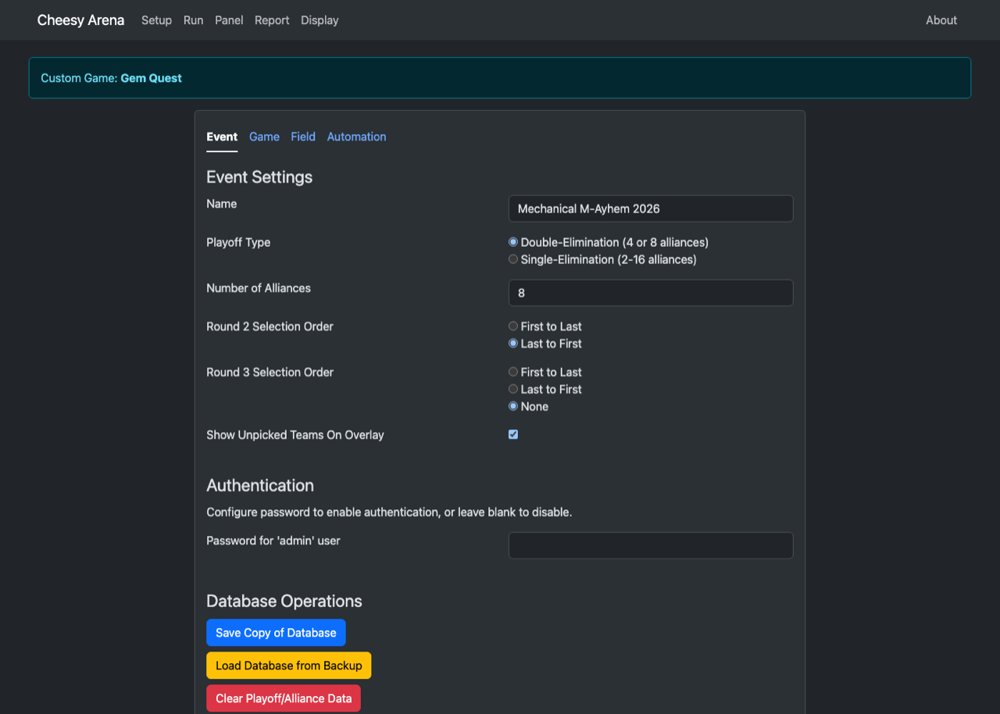
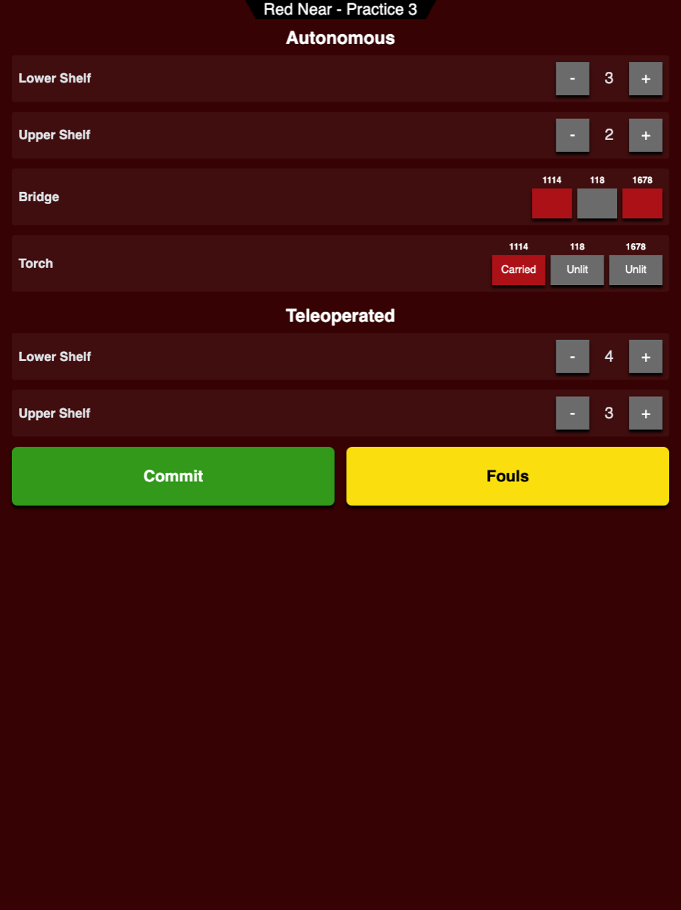
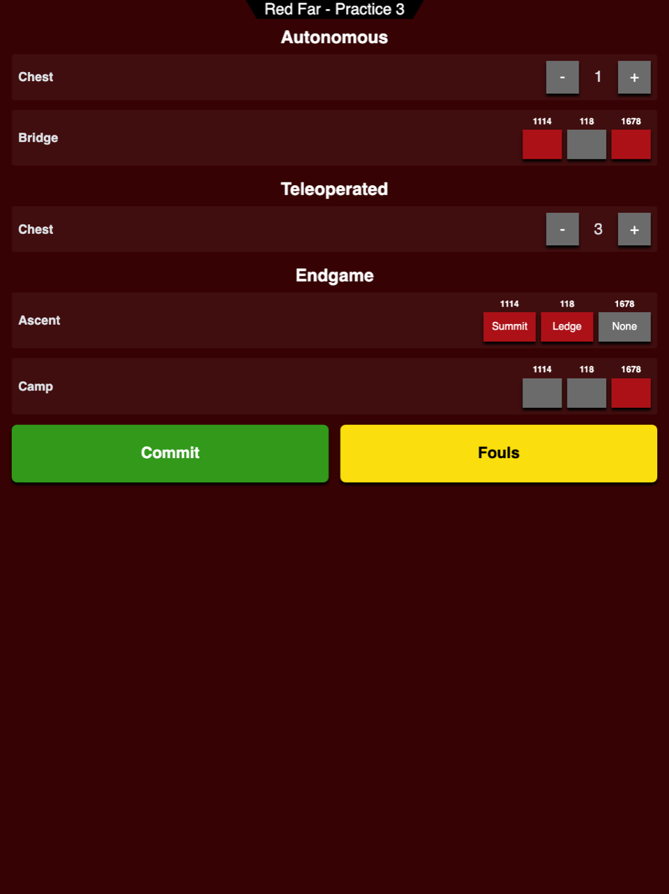
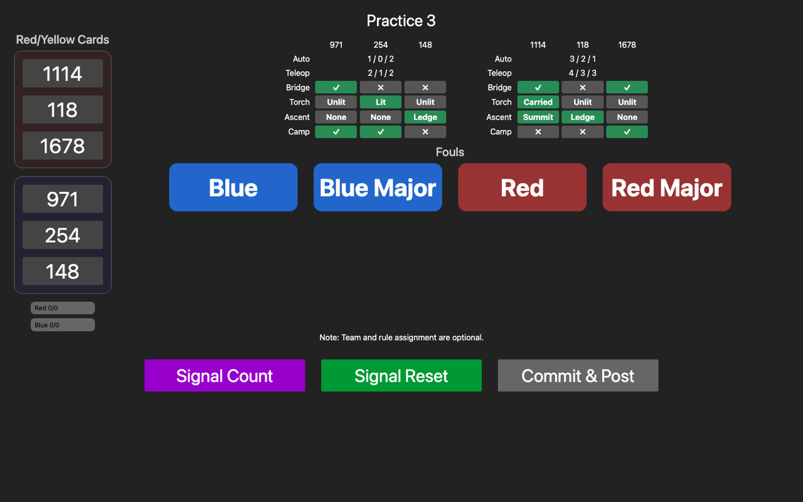
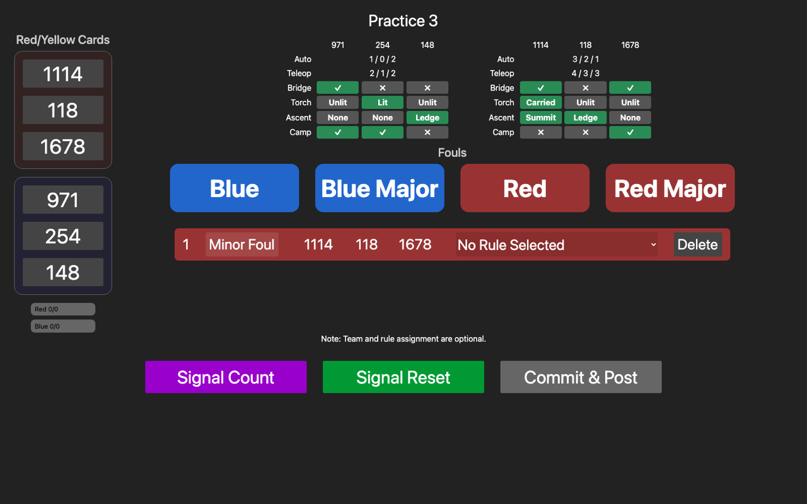
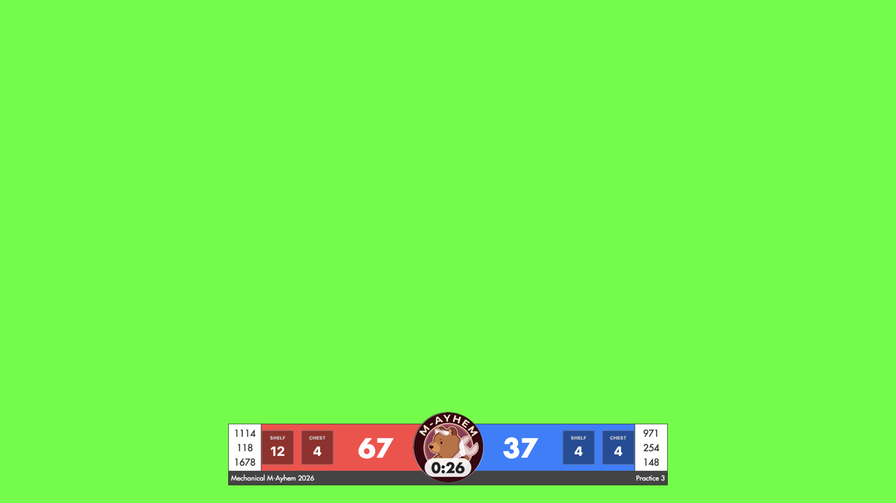
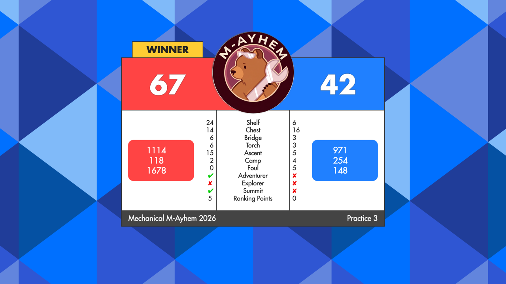
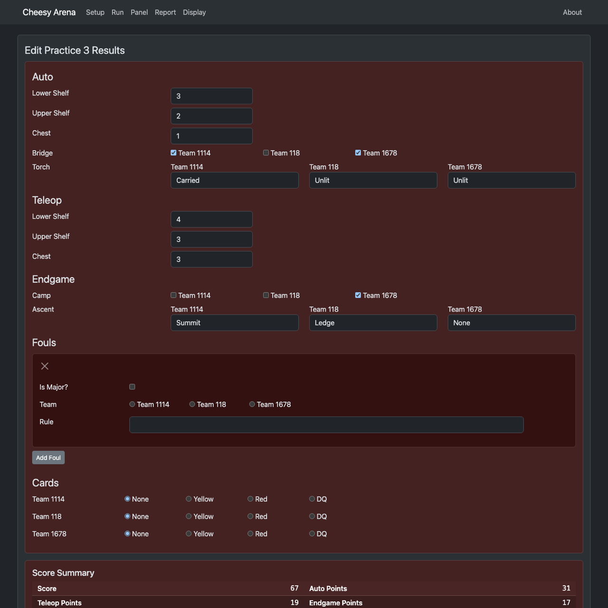
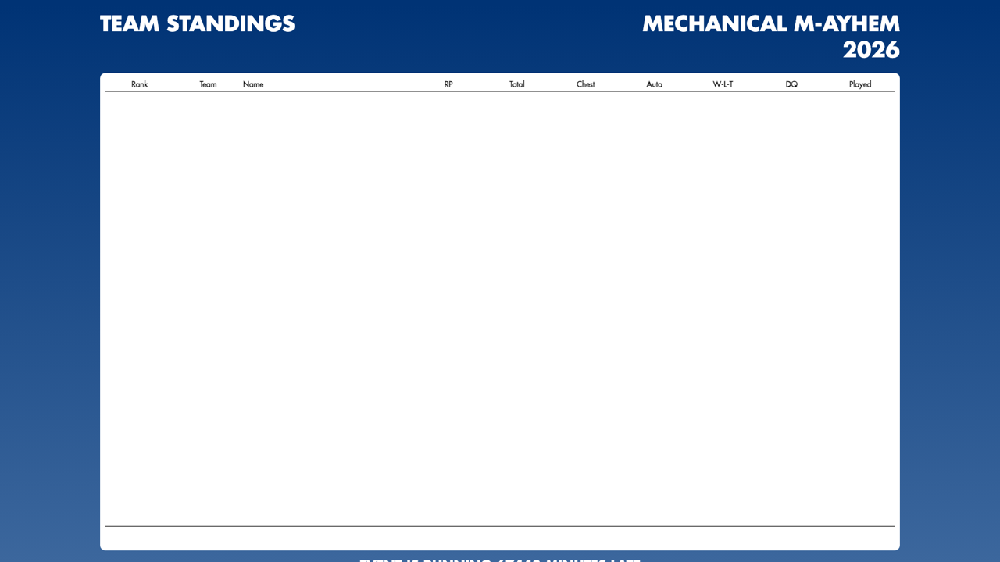

# Example: Gem Quest, end to end

This walks through the game that ships in `game/custom_game.yaml`: the config, the ranking-point
logic, the rule list, and what each screen looks like while a practice match is scored. The
screenshots come from a real run of Practice 3 with teams 1114, 118 and 1678 on red and 971, 254
and 148 on blue. See [CUSTOM_GAMES.md](CUSTOM_GAMES.md) for the reference.

## The game

Robots collect gems and score them on a two-layer **shelf** on the near side of the field or in a
**treasure chest** on the far side. Gems are worth double during auto, and the upper shelf layer
is worth double the lower one. In auto each robot can cross the **bridge** out of the starting
cave and light a **torch**, or light it and carry it across. In endgame each robot either climbs
the cliff to the **ledge** or the **summit**, or retreats to **camp**.

| Element | Auto | Teleop | Endgame | Scored by |
|---------|-----:|-------:|--------:|-----------|
| Lower Shelf (per gem) | 2 | 1 | | near |
| Upper Shelf (per gem) | 4 | 2 | | near |
| Chest (per gem) | 5 | 3 | | far |
| Bridge (per robot) | 3 | | | either |
| Torch (per robot) | Unlit 0 / Lit 3 / Carried 6 | | | near |
| Ascent (per robot) | | | None 0 / Ledge 5 / Summit 10 | far |
| Camp (per robot) | | | 2 | far |

Three bonus ranking points:

- **Adventurer**: at least 30 points worth of gems across the shelf and the chest.
- **Explorer**: all three robots crossed the bridge in auto.
- **Summit**: at least two robots finished on the ledge or the summit.

Rankings sort by ranking points, then total points, then chest points, then auto points. A tied
playoff match goes to auto points, then shelf points, then total points.

## 1. The config

`game/custom_game.yaml`:

```yaml
game:
  name: "Gem Quest"

fouls:
  minor_foul_points: 5
  major_foul_points: 15

# game_pieces: Declare the physical game pieces. Required on each scoring_counts entry (a count is
# always "a robot scoring a piece"). Piece identity only — it is not a rollup; to group counts
# together, give them a shared scoring_group (below).
game_pieces:
  - id: gem
    display_name: "Gem"

# scoring_groups: Declare rollup buckets. A scoring_counts entry tagged with scoring_group has its
# live count and points summed into this bucket — summary.GroupPoints[<group id>] and the audience
# display. An entry with no scoring_group is its own bucket under its own id (so a lone element
# needs no wrapper group). Tiebreakers reference buckets by id.
scoring_groups:
  - id: shelf
    display_name: "Shelf"
  - id: chest
    display_name: "Chest"

# scoring_counts: Auto/teleop/endgame counter elements. Each entry lists the phases it can be
# scored in, each with its own points value (a piece can be worth different points in different
# phases or on different structures).
# scorer (optional, near|far): which scoring panel shows this element. /panels/scoring/red_near
# shows only near-tagged and untagged elements, red_far only far-tagged and untagged ones, and
# /panels/scoring/red shows everything. Omit it if one scorer covers the whole alliance.
scoring_counts:
  # The shelf is a two-layer structure on the near side of the field. Gems on the upper layer are
  # worth more, and every gem is worth double during auto.
  - id: shelf_lower
    display_name: "Lower Shelf"
    game_piece: gem
    scoring_group: shelf
    scorer: near
    phases:
      - phase: auto
        points: 2
      - phase: teleop
        points: 1

  - id: shelf_upper
    display_name: "Upper Shelf"
    game_piece: gem
    scoring_group: shelf
    scorer: near
    phases:
      - phase: auto
        points: 4
      - phase: teleop
        points: 2

  # The treasure chest sits on the far side; a gem dropped in during auto is worth the most.
  - id: chest_gem
    display_name: "Chest"
    game_piece: gem
    scoring_group: chest
    scorer: far
    phases:
      - phase: auto
        points: 5
      - phase: teleop
        points: 3

# statuses: Per-robot statuses (3 robots per alliance). Phases takes exactly one entry, same
# {phase, points} shape as scoring_counts (auto or endgame only — teleop is not supported for
# statuses).
# No 'values' field: a yes/no status per robot; phases[0].points is awarded per robot that has it.
# With 'values' as a list: a multi-state status per robot with per-state points (the first value is
# the default and must be worth 0); phases[0].points is unused in that case.
statuses:
  # Crossing the bridge out of the starting cave during auto. No scorer hint, so both panels show it.
  - id: bridge
    display_name: "Bridge"
    phases:
      - phase: auto
        points: 3

  # Each robot can light a torch during auto, or light it and carry it across the bridge.
  - id: torch
    display_name: "Torch"
    scorer: near
    phases:
      - phase: auto
    values:
      - id: unlit
        display_name: "Unlit"
        points: 0
      - id: lit
        display_name: "Lit"
        points: 3
      - id: carried
        display_name: "Carried"
        points: 6

  # Endgame: robots climb the cliff face on the far side to the ledge or all the way to the summit...
  - id: ascent
    display_name: "Ascent"
    scorer: far
    phases:
      - phase: endgame
    values:
      - id: none
        display_name: "None"
        points: 0
      - id: ledge
        display_name: "Ledge"
        points: 5
      - id: summit
        display_name: "Summit"
        points: 10

  # ...or retreat to the base camp.
  - id: camp
    display_name: "Camp"
    scorer: far
    phases:
      - phase: endgame
        points: 2

# ranking_points: Bonus ranking points. Each logic_func names a Go function registered in
# game/custom_scoring_logic.go; the server refuses to start if one is missing.
ranking_points:
  - id: adventurer_rp
    display_name: "Adventurer"
    logic_func: "ComputeAdventurerRP"

  - id: explorer_rp
    display_name: "Explorer"
    logic_func: "ComputeExplorerRP"

  - id: summit_rp
    display_name: "Summit"
    logic_func: "ComputeSummitRP"

# ranking_tiebreakers: Metrics used, in order, to sort the qualification rankings after ranking
# points. Metrics are auto_points, teleop_points, endgame_points, total_points, a scoring_group id,
# or a status id.
ranking_tiebreakers:
  - metric: total_points
  - metric: chest
  - metric: auto_points

# playoff_tiebreakers: Metrics used, in order, to break a tied playoff match. Same metric
# vocabulary as ranking_tiebreakers. Opponent major fouls are always checked first (implicit).
playoff_tiebreakers:
  - metric: auto_points
  - metric: shelf
  - metric: total_points
```

## 2. The ranking-point logic

`game/custom_scoring_logic.go`:

```go
//go:build custom

package game

// Bonus ranking-point logic for the game defined in custom_game.yaml. Each function is registered
// under the logic_func name the YAML uses; the server refuses to start if one is missing.
func init() {
	RegisterLogicFunc("ComputeAdventurerRP", ComputeAdventurerRP)
	RegisterLogicFunc("ComputeExplorerRP", ComputeExplorerRP)
	RegisterLogicFunc("ComputeSummitRP", ComputeSummitRP)
}

// AdventurerPointThreshold is the combined shelf and chest score that earns the Adventurer bonus.
const AdventurerPointThreshold = 30

// ComputeAdventurerRP: the alliance scored at least AdventurerPointThreshold points worth of gems
// across the shelf (either layer) and the treasure chest, in any phase.
func ComputeAdventurerRP(score, opponentScore *Score, summary *ScoreSummary) bool {
	return summary.GroupPoints["shelf"]+summary.GroupPoints["chest"] >= AdventurerPointThreshold
}

// ComputeExplorerRP: all three robots crossed the bridge during auto.
func ComputeExplorerRP(score, opponentScore *Score, summary *ScoreSummary) bool {
	return score.CountBoolStatus("bridge") == 3
}

// ComputeSummitRP: at least two robots finished on the ledge or the summit (ascent value index 1
// is "ledge", 2 is "summit").
func ComputeSummitRP(score, opponentScore *Score, summary *ScoreSummary) bool {
	return score.CountEnumStatus("ascent", 1) >= 2
}
```

Each function is registered under the name the YAML uses. The Adventurer bonus reads the computed
summary, where the shelf and chest points are already rolled up by scoring group; the other two
read per-robot statuses straight from the score.

## 3. The rules

`game/custom_rules.go` is the referee's rule list. The shipped file carries the 2026 FRC rules as
a starting point; here is its shape:

```go
type Rule struct {
	Id             int
	RuleNumber     string
	IsMajor        bool
	IsRankingPoint bool
	Description    string
}

// All rules from the 2022 game that carry point penalties.
// @formatter:off
var rules = []*Rule{
	{1, "G206", false, true, "A team or ALLIANCE may not collude with another team to each purposefully violate a rule in an attempt to influence Ranking Points."},
	// ...
}
```

Rules flagged `IsRankingPoint` are the ones `HasRankingPointFoul` counts, so a fourth bonus for
"the opponent committed a G206" would be written as
`return opponentScore.HasRankingPointFoul("G206")`.

## 4. Build and run

```bash
go build -tags custom .
./cheesy-arena -dev
```

The settings page confirms which game is loaded:



## 5. Scoring a match

Two scorers per alliance. The near scorer's panel shows the shelf and the torch; the far scorer's
panel shows the chest, the ascent and camp. The bridge has no `scorer` hint, so both panels show
it. Team numbers come from the loaded match.

Red near (`/panels/scoring/red_near`): three gems on the lower shelf and two on the upper shelf in
auto, 1114 and 1678 crossed the bridge, 1114 carried its torch, then four lower and three upper
gems in teleop.



Red far (`/panels/scoring/red_far`): one gem in the chest in auto and three in teleop; 1114
reached the summit, 118 the ledge, and 1678 went to camp.



## 6. The referee panel

Both alliances' live values, with ✓/✗ for yes/no statuses and the value name for the torch and
the ascent. Cards are assigned per team on the left.



Pressing **Red** adds a foul row. The referee picks the team and the rule from `custom_rules.go`;
both are optional. This foul stays in the result below and gives blue 5 points.



## 7. The audience display during the match

One live counter per scoring group, showing gem counts, and the running score.



## 8. The post-match summary

After Match Play commits the match, the audience score screen shows the breakdown by group and
status, fouls, one row per bonus ranking point, and total ranking points.



Reconciling red's 67 against the config:

| Row | Computation | Points |
|-----|-------------|-------:|
| Shelf | auto 3 × 2 + 2 × 4, teleop 4 × 1 + 3 × 2 | 24 |
| Chest | auto 1 × 5, teleop 3 × 3 | 14 |
| Bridge | 2 robots × 3 | 6 |
| Torch | one robot Carried | 6 |
| Ascent | Summit 10 + Ledge 5 | 15 |
| Camp | 1 robot × 2 | 2 |
| Foul | none against blue | 0 |
| **Score** | | **67** |

Adventurer ✓ because shelf plus chest is 38, at least 30. Explorer ✗ because only two robots
crossed the bridge. Summit ✓ because two robots finished on the ledge or higher. Ranking points:
3 for the win plus 2 bonuses = 5.

Blue's 42 is shelf 6, chest 16, bridge 3, torch 3 (one Lit), ascent 5 (one Ledge), camp 4, plus
the 5 points from red's foul. Shelf plus chest is 22, so no Adventurer bonus.

## 9. Editing the result

The edit page renders the same elements as inputs, labelled with the teams from the match, plus
the foul and the cards. The summary card updates as you type, including the ranking-point rows.



## 10. Rankings

The rankings display and reports show one column per ranking tiebreaker: Total, Chest and Auto
(the CSV and PDF reports spell out "Total Points" and "Auto Points").



## Changing the game

Edit the YAML and restart. Adding a scoring count is one YAML entry; every panel, the audience
breakdown and the edit page pick it up. Adding a bonus ranking point is one YAML entry plus one
Go function. Renaming a display name changes every label at once. A mistake in the YAML stops
the server at startup with the line that is wrong. For a second configuration see
`game/examples/high_seas_havoc.yaml`; it needs its own ranking-point functions before it will
start.
